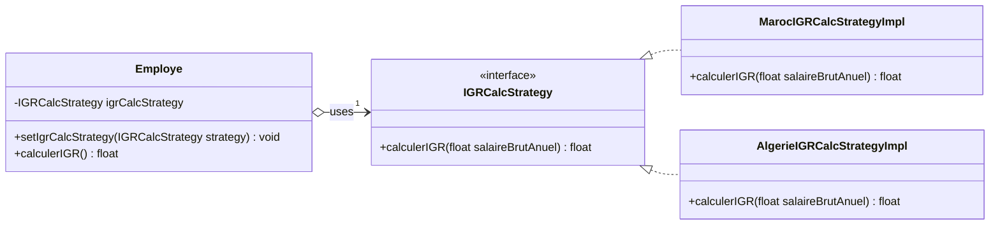
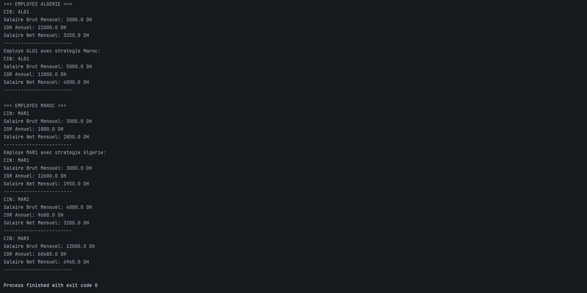

# Strategy Pattern - Employee Tax Calculation

## Class Diagram



## Implementation

### 1. Strategy Interface

```java
package org.glsid;

public interface IGRCalcStrategy {
    float calculerIGR(float salaireBrutAnuel);
}
```

### 2. Employee

```java
package org.glsid;

public class Employe {
    private String cin;
    private float salaireBrutMensuel;
    private IGRCalcStrategy igrCalcStrategy;

    public Employe(String cin, float salaireBrutMensuel, IGRCalcStrategy igrCalcStrategy) {
        this.cin = cin;
        this.salaireBrutMensuel = salaireBrutMensuel;
        this.igrCalcStrategy = igrCalcStrategy;
    }

    public void setIgrCalcStrategy(IGRCalcStrategy igrCalcStrategy) {
        this.igrCalcStrategy = igrCalcStrategy;
    }

    public float calculerIGR(){
        float salaireBrutAnuel = salaireBrutMensuel * 12;
        return igrCalcStrategy.calculerIGR(salaireBrutAnuel);
    }
    
    public float getSalaireNetMensuel(){
        float igr=calculerIGR();
        float salaireNetAnuel=salaireBrutMensuel*12-igr;
        return salaireNetAnuel/12;
    }

    public String getCin() {
        return cin;
    }

    public void setCin(String cin) {
        this.cin = cin;
    }

    public float getSalaireBrutMensuel() {
        return salaireBrutMensuel;
    }

    public void setSalaireBrutMensuel(float salaireBrutMensuel) {
        this.salaireBrutMensuel = salaireBrutMensuel;
    }
}
```

### 3. Concrete Strategy - Morocco Tax Calculation

```java
package org.glsid;

public class MarocIGRCalcStrategyImpl implements IGRCalcStrategy {
    @Override
    public float calculerIGR(float salaireBrutAnuel) {
        if (salaireBrutAnuel >= 120000) return salaireBrutAnuel * 0.42f;
        if (salaireBrutAnuel >= 40000) return salaireBrutAnuel * 0.20f;
        return salaireBrutAnuel * 0.05f;
    }
}
```

### 4. Concrete Strategy - Algeria Tax Calculation

```java
package org.glsid;

public class AlgerieIGRCalcStrategyImpl implements IGRCalcStrategy {
    @Override
    public float calculerIGR(float salaireBrutAnuel) {
        return salaireBrutAnuel * 0.35f;
    }
}
```

### 5. Main

```java
package org.glsid;

public class Main {
    public static void main(String[] args) {
        IGRCalcStrategy algerieStrategy = new AlgerieIGRCalcStrategyImpl();
        IGRCalcStrategy marocStrategy = new MarocIGRCalcStrategyImpl();

        Employe employeAlgerie1 = new Employe("ALG1", 5000, algerieStrategy);

        Employe employeMaroc1 = new Employe("MAR1", 3000, marocStrategy);
        Employe employeMaroc2 = new Employe("MAR2", 4000, marocStrategy);
        Employe employeMaroc3 = new Employe("MAR3", 12000, marocStrategy);

        System.out.println("=== EMPLOYES ALGERIE ===");
        afficherInfosEmploye(employeAlgerie1);
        employeAlgerie1.setIgrCalcStrategy(marocStrategy);
        System.out.println("Employe " + employeAlgerie1.getCin() + " avec strategie Maroc:");
        afficherInfosEmploye(employeAlgerie1);

        System.out.println("\n=== EMPLOYES MAROC ===");
        afficherInfosEmploye(employeMaroc1);
        employeMaroc1.setIgrCalcStrategy(algerieStrategy);
        System.out.println("Employe " + employeMaroc1.getCin() + " avec strategie Algerie:");
        afficherInfosEmploye(employeMaroc1);
        afficherInfosEmploye(employeMaroc2);
        afficherInfosEmploye(employeMaroc3);
    }

    private static void afficherInfosEmploye(Employe employe) {
        System.out.println("CIN: " + employe.getCin());
        System.out.println("Salaire Brut Mensuel: " + employe.getSalaireBrutMensuel() + " DH");
        System.out.println("IGR Annuel: " + employe.calculerIGR() + " DH");
        System.out.println("Salaire Net Mensuel: " + employe.getSalaireNetMensuel() + " DH");
        System.out.println("------------------------");
    }
}
```
## Output
