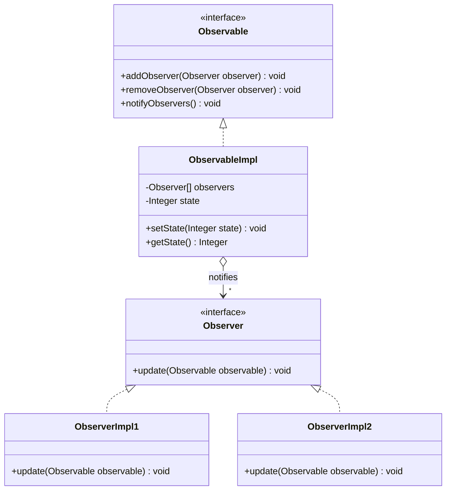
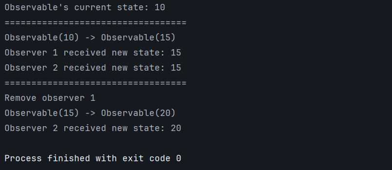

# Observer Pattern - Generic Implementation

## Class Diagram



## Implementation

### 1. Observable Interface

```java
package org.glsid;

public interface Observable {
    void addObserver(Observer observer);
    void removeObserver(Observer observer);
    void notifyObservers();
}
```

### 2. Observer Interface

```java
package org.glsid;

public interface Observer {
    public void update(Observable observable);
}
```

### 3. Observable Implementation

```java
package org.glsid;

import java.util.ArrayList;
import java.util.List;

public class ObservableImpl implements Observable {
    private final List<Observer> observers = new ArrayList<>();
    private Integer state;

    public ObservableImpl(Integer state) {
        this.state = state;
    }

    @Override
    public void addObserver(Observer observer) {
        observers.add(observer);
    }

    @Override
    public void removeObserver(Observer observer) {
        observers.remove(observer);
    }

    @Override
    public void notifyObservers() {
        observers.forEach(obs -> obs.update(this));
    }

    public Integer getState() {
        return state;
    }

    public void setState(Integer state) {
        this.state = state;
        notifyObservers();
    }
}
```

### 4. Observer Implementation 1

```java
package org.glsid;

public class ObserverImpl1 implements Observer {
    @Override
    public void update(Observable observable) {
        var newState = ((ObservableImpl)observable).getState();
        System.out.println("Observer 1 received new state: " + newState);
    }
}
```

### 5. Observer Implementation 2

```java
package org.glsid;

public class ObserverImpl2 implements Observer {
    @Override
    public void update(Observable observable) {
        var newState = ((ObservableImpl)observable).getState();
        System.out.println("Observer 2 received new state: " + newState);
    }
}
```

### 6. Main

```java
package org.glsid;

public class Main {

    public static void main(String[] args) {
        var observable = new ObservableImpl(10);
        var observer1 = new ObserverImpl1();
        var observer2 = new ObserverImpl2();

        observable.addObserver(observer1);
        observable.addObserver(observer2);
        System.out.println("Observable's current state: " + observable.getState());

        System.out.println("==================================");

        System.out.println("Observable(10) -> Observable(15)");
        observable.setState(15);

        System.out.println("==================================");

        System.out.println("Remove observer 1");
        observable.removeObserver(observer1);

        System.out.println("Observable(15) -> Observable(20)");
        observable.setState(20);
    }
}
```

## Output
