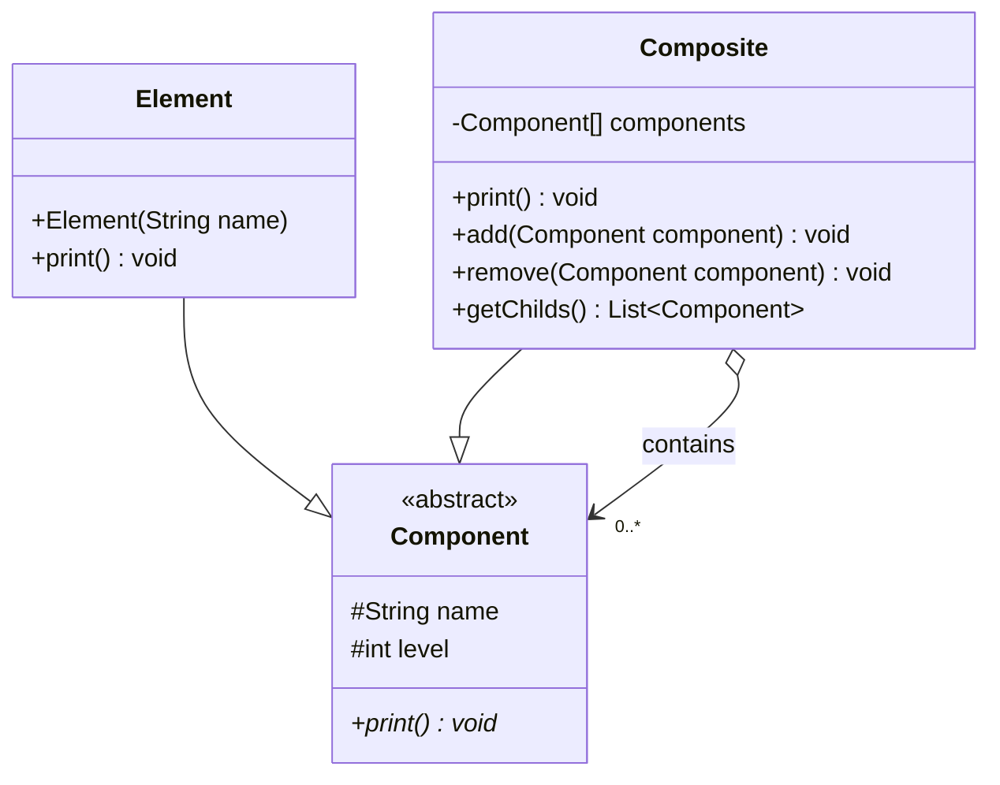
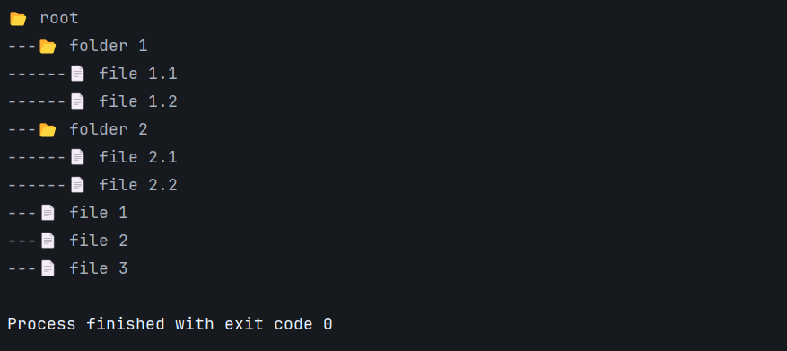

# Composite Pattern - Generic Implementation

## Class Diagram



## Implementation

### 1. Component Abstract Class

```java
package org.glsid;

public abstract class Component {
    protected String name;
    protected int level;
    
    public Component(String name) {
        this.name = name;
    }
    
    public abstract void print();
}
```

### 2. Element (Leaf)

```java
package org.glsid;

public class Element extends Component {
    public Element(String name) {
        super(name);
    }

    @Override
    public void print() {
        System.out.printf("%s📄 %s\n", "---".repeat(level), name);
    }
}
```

### 3. Composite

```java
package org.glsid;

import java.util.ArrayList;
import java.util.List;

public class Composite extends Component {
    private final List<Component> components = new ArrayList<>();
    
    public Composite(String name) { 
        super(name); 
    }
    
    @Override
    public void print() {
        System.out.printf("%s📂 %s\n", "---".repeat(level), name);
        components.forEach(Component::print);
    }
    
    public void add(Component componant){
        componant.level = this.level + 1; 
        components.add(componant);
    }
    
    public void remove(Component componant){ 
        components.remove(componant); 
    }
    
    public List<Component> getChilds(){ 
        return components; 
    }
}
```

### 4. Main

```java
package org.glsid;

public class Main {
    public static void main(String[] args) {
        Composite root = new Composite("root");
        Composite folder1 = new Composite("folder 1");
        Composite folder2 = new Composite("folder 2");

        root.add(folder1);
        root.add(folder2);

        root.add(new Element("file 1"));
        root.add(new Element("file 2"));
        root.add(new Element("file 3"));

        folder1.add(new Element("file 1.1"));
        folder1.add(new Element("file 1.2"));
        folder2.add(new Element("file 2.1"));
        folder2.add(new Element("file 2.2"));

        root.print();
    }
}
```

## Output

