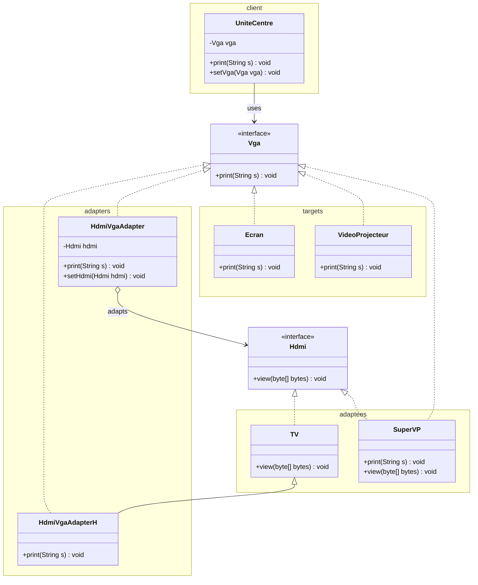
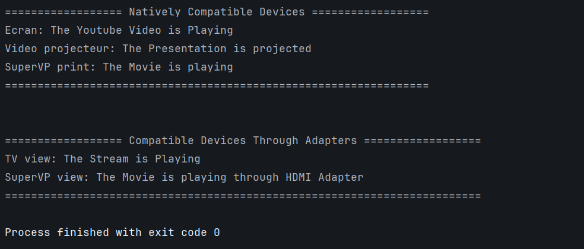

# Adapter Pattern - HDMI to VGA

## Class Diagram


## Implementation

### 1. Target Interface (VGA)

```java
package org.glsid.adaptee;

public interface Vga {
    void print(String s);
}
```

### 2. Adaptee Interface (HDMI)

```java
package org.glsid.adaptee;

public interface Hdmi {
    void view(byte[] bytes);
}
```

### 3. Client (UniteCentre)

```java
package org.glsid.adaptee;

import org.glsid.interfaces.Vga;

public class UniteCentre {
    Vga vga;

    public void print(String s) {
        vga.print(s);
    }

    public void setVga(Vga vga) {
        this.vga = vga;
    }
}
```

### 4. VGA Compatible Devices

```java
package org.glsid.adaptee;

import org.glsid.interfaces.Vga;

public class Ecran implements Vga {
    public void print(String s) {
        System.out.println("Ecran: " + s);
    }
}
```

```java
package org.glsid.adaptee;

import org.glsid.interfaces.Vga;

public class VideoProjecteur implements Vga {
    @Override
    public void print(String s) {
        System.out.println("Video projecteur: " + s);
    }
}
```

### 5. HDMI Device (TV)

```java
package org.glsid.adaptee;

import org.glsid.interfaces.Hdmi;

public class TV implements Hdmi {

    @Override
    public void view(byte[] bytes) {
        System.out.println("TV view: " + new String(bytes));
    }
}
```

### 6. Dual Interface Device (SuperVP)

```java
package org.glsid.adaptee;

import org.glsid.interfaces.Hdmi;
import org.glsid.interfaces.Vga;

public class SuperVP implements Vga, Hdmi {
    @Override
    public void view(byte[] bytes) {
        System.out.println("SuperVP view: " + new String(bytes));
    }

    @Override
    public void print(String s) {
        System.out.println("SuperVP print: " + s);
    }
}
```

### 7. Object Adapter (Composition)

```java
package org.glsid.adapters;

import org.glsid.interfaces.Hdmi;
org.glsid.interfaces.Vga;

public class HdmiVgaAdapter implements Vga {
    private org.glsid.interfaces.Hdmi hdmi;

    public HdmiVgaAdapter(Hdmi hdmi) {
        this.hdmi = hdmi;
    }

    @Override
    public void print(String s) {
        byte[] bytes = s.getBytes();
        hdmi.view(bytes);
    }

    public void setHdmi(Hdmi hdmi) {
        this.hdmi = hdmi;
    }
}
```

### 8. Class Adapter (Inheritance)

```java
package org.glsid.adapters;

import org.glsid.adaptee.TV;
import org.glsid.interfaces.Vga;

public class HdmiVgaAdapterH extends TV implements Vga {
    @Override
    public void print(String s) {
        byte[] bytes = s.getBytes();
        view(bytes);
    }
}
```

### 9. Main

```java
package org.glsid;

import org.glsid.adapters.HdmiVgaAdapter;
import org.glsid.adapters.HdmiVgaAdapterH;
import org.glsid.adaptee.*;
import org.glsid.client.UniteCentre;

public class Main {
    public static void main(String[] args) {
        UniteCentre uc = new UniteCentre();

        System.out.println("================== Natively Compatible Devices ==================");
        uc.setVga(new Ecran());
        uc.print("The Youtube Video is Playing");
        uc.setVga(new VideoProjecteur());
        uc.print("The Presentation is projected");
        uc.setVga(new SuperVP());
        uc.print("The Movie is playing");
        System.out.println("=".repeat(65) + "\n\n");

        System.out.println("================== Compatible Devices Through Adapters ==================");
        HdmiVgaAdapterH hdmiVgaAdapterH = new HdmiVgaAdapterH();
        HdmiVgaAdapter hdmiVgaAdapter = new HdmiVgaAdapter(new SuperVP());
        uc.setVga(hdmiVgaAdapterH);
        uc.print("The Stream is Playing");
        uc.setVga(hdmiVgaAdapter);
        uc.print("The Movie is playing through HDMI Adapter");
        System.out.println("=".repeat(73));
    }
}
```

## Output

