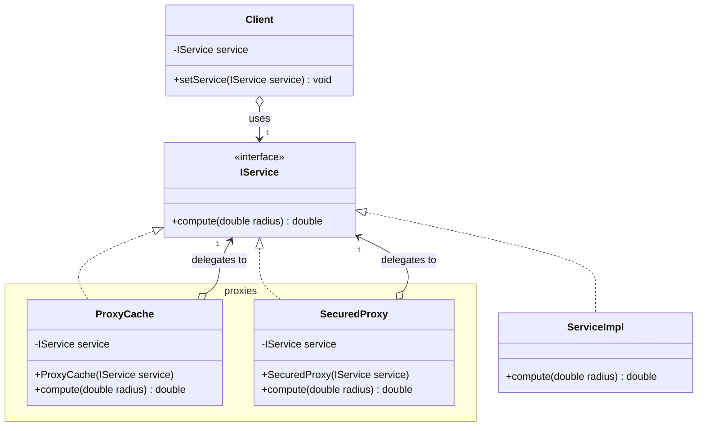
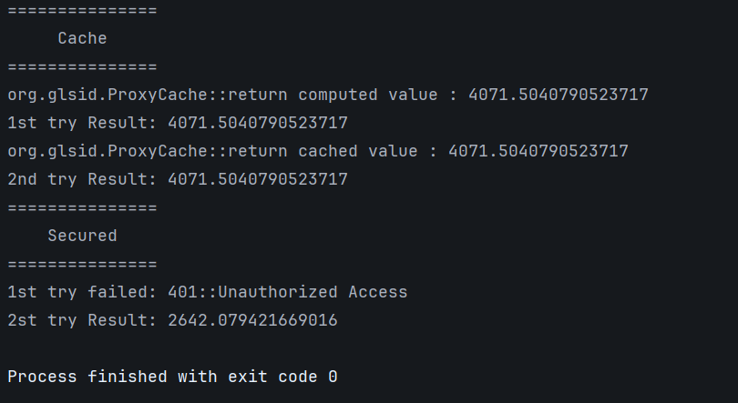

# Proxy Pattern - Secure Cache Service

## Class Diagram



## Implementation

### 1. Service Interface

```java
public interface IService {
    double compute(double radius);
}
```

### 2. Real Service Implementation

```java
import org.glsid.IService;

public class ServiceImpl implements IService {
    @Override
    public double compute(double radius) {
        return Math.PI * radius * radius;
    }
}
```

### 3. Cache Proxy

```java
import org.glsid.IService;

import java.util.HashMap;
import java.util.Map;

public class ProxyCache implements IService {
    IService service;
    Map<Double, Double> cache = new HashMap<>();

    public ProxyCache(IService service) {
        this.service = service;
    }

    @Override
    public double compute(double radius) {
        if (cache.containsKey(radius)) {
            double area = cache.get(radius);
            System.out.println("org.glsid.ProxyCache::return cached value : " + area);
            return area;
        }

        double area = service.compute(radius);
        System.out.println("org.glsid.ProxyCache::return computed value : " + area);
        cache.put(radius, area);

        return area;
    }
}
```

### 4. Security Proxy

```java
import org.glsid.IService;

public class SecuredProxy implements IService {
    private IService service;
    private String password;

    public SecuredProxy(IService service) {
        this.service = service;
    }

    @Override
    public double compute(double radius) throws RuntimeException {
        if (!password.equals("12345"))
            throw new RuntimeException("401::Unauthorized Access");

        return service.compute(radius);
    }

    public void setPassword(String password) {
        this.password = password;
    }

    public void setService(IService service) {
        this.service = service;
    }
}
```

### 5. Client

```java
import org.glsid.IService;

public class Client {
    private IService service;

    public double perform(double radius) {
        return service.compute(radius);
    }

    public void setService(IService service) {
        this.service = service;
    }
}
```

### 6. Main Application

```java
import org.glsid.*;

public class Main {
    public static void main(String[] args) {
        IService service = new ServiceImpl();
        ProxyCache cacheProxy = new ProxyCache(service);
        SecuredProxy securedProxy = new SecuredProxy(service);

        Client client = new Client();

        System.out.println("=".repeat(15));
        System.out.printf("%10s%n", "Cache");
        System.out.println("=".repeat(15));

        client.setService(cacheProxy);
        System.out.println("1st try Result: " + client.perform(36));
        System.out.println("2nd try Result: " + client.perform(36));

        System.out.println("=".repeat(15));
        System.out.printf("%11s%n", "Secured");
        System.out.println("=".repeat(15));

        securedProxy.setPassword("password");
        try {
            client.setService(securedProxy);
            System.out.println("1st try Result: " + client.perform(28));
        } catch (RuntimeException e) {
            System.out.println("1st try failed: " + e.getMessage());
        }
        securedProxy.setPassword("12345");
        client.setService(securedProxy);
        System.out.println("2st try Result: " + client.perform(29));
    }
}
```

## Output

