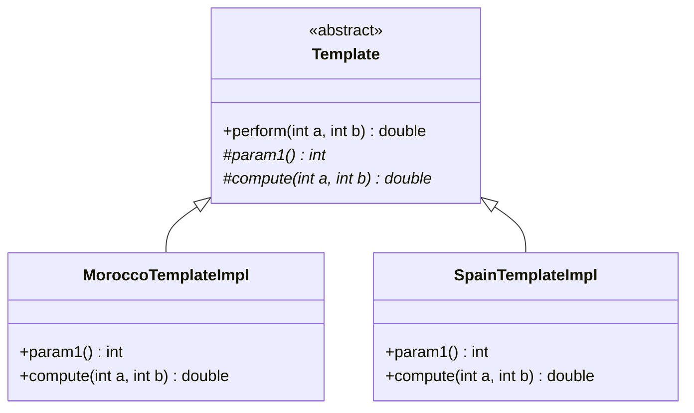
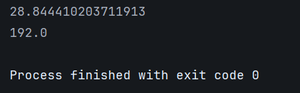

# Template Pattern - Algorithm Framework

## Class Diagram



## Implementation

### 1. Abstract Template

```java
package org.glsid;

public abstract class Template {

    public double perform(int a, int b){
        int n = param1();
        double sum =0;
        for (int i =0 ; i<n;i++){
            double step1 = compute(a,b);
            sum+=step1;
        }
        return sum;
    }

    protected abstract int param1();
    protected abstract double compute(int a, int b);
}
```

### 2. Morocco Implementation

```java
package org.glsid;

public class MoroccoTemplateImpl extends Template{
    @Override
    protected int param1() {
        return 4;
    }

    @Override
    protected double compute(int a, int b) {
        return Math.sqrt(a*a + b*b);
    }
}
```

### 3. Spain Implementation

```java
package org.glsid;

public class SpainTemplateImpl extends Template{
    @Override
    protected int param1() {
        return 8;
    }

    @Override
    protected double compute(int a, int b) {
        return a*b;
    }
}
```

### 4. Main Application

```java
package org.glsid;

public class Main {
    public static void main(String[] args) {
        Template template = new MoroccoTemplateImpl();
        System.out.println(template.perform(2,5));
        template = new SpainTemplateImpl();
        System.out.println(template.perform(2,5));
    }
}
```

## Output

